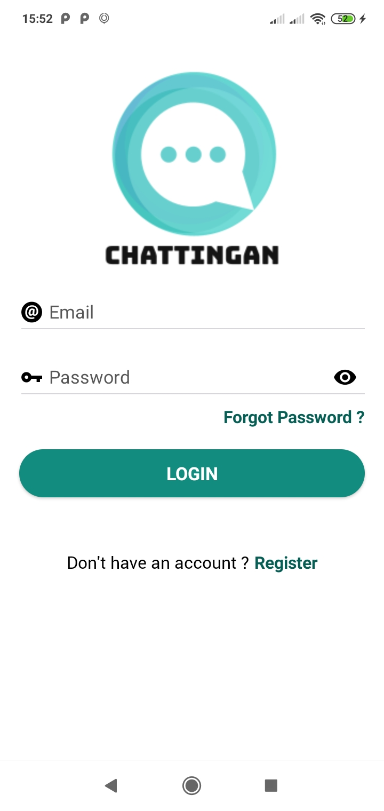
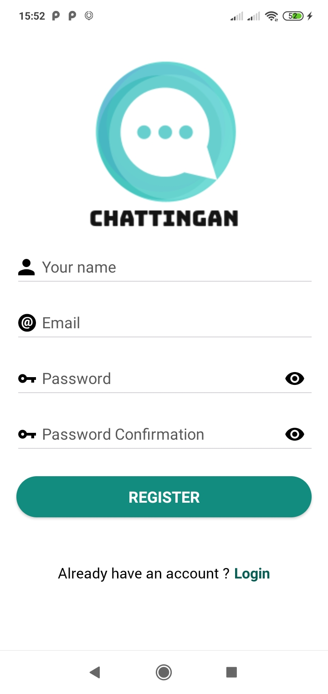
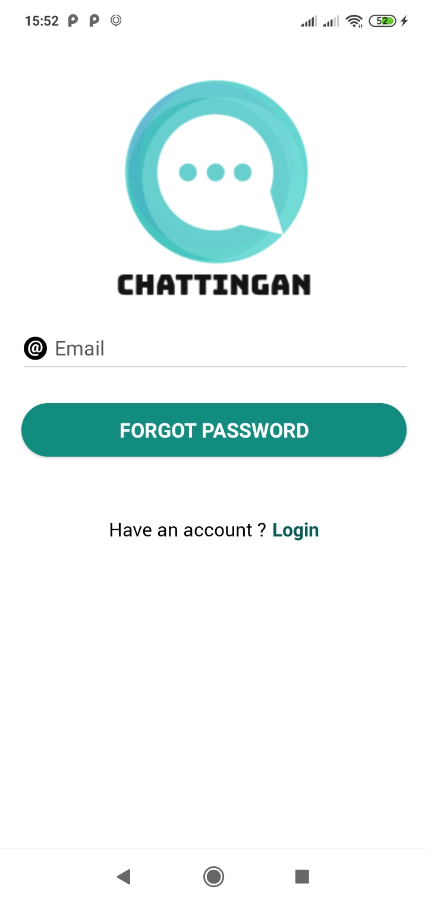
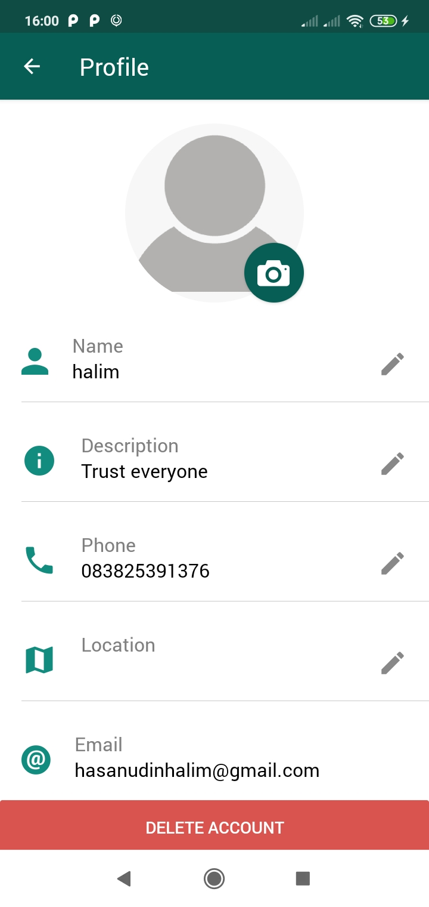
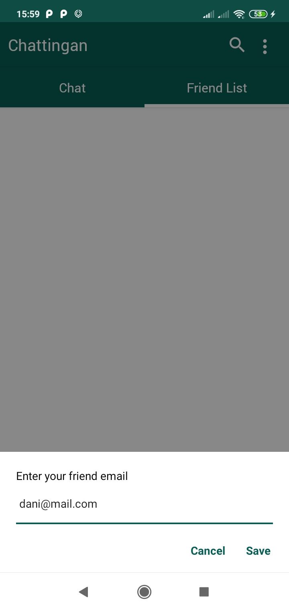
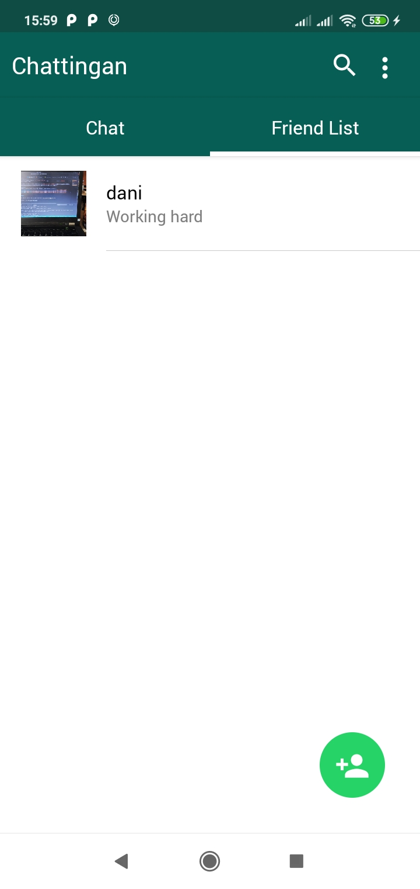
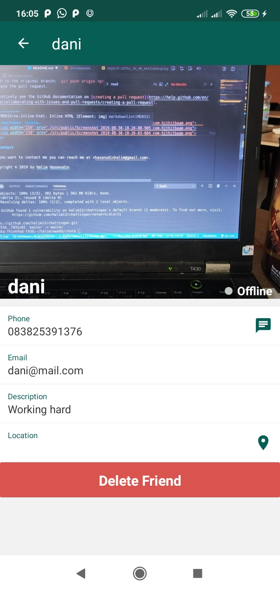
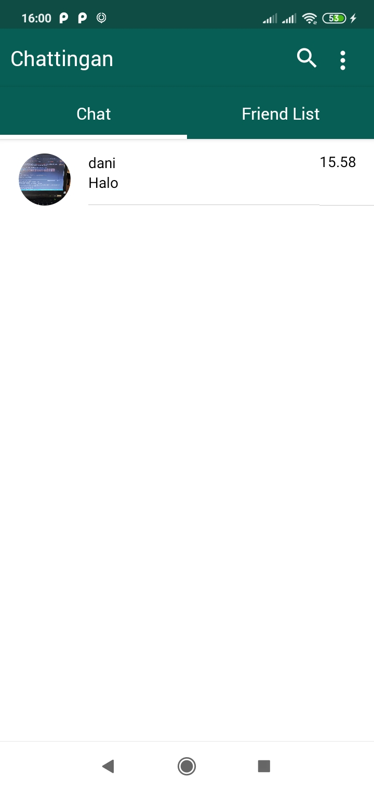
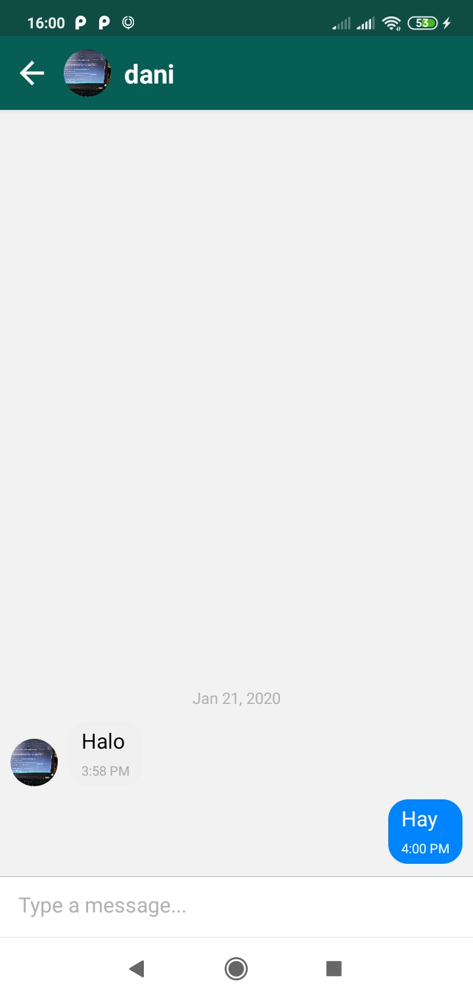

<h1 align="center">Chattingan - Realtime Chat App Android</h1>
<p align="center">
  
  
  
</p>

## Introduction

Chattingan is Android App for send message with other people and you can track their location easily. Built using React Native Framework and Firebase database.

React Native is a JavaScript framework for writing real, natively rendering mobile applications for iOS and Android. [More about React Native](https://facebook.github.io/react-native/)

Firebase is a mobile and web application development platform developed by Firebase, Inc. in 2011, then acquired by Google in 2014. [More about Firebase](https://console.firebase.google.com/u/0/?hl=id)

## Built With
[](https://facebook.github.io/react-native/)
[](https://firebase.google.com/?hl=id)

## Requirements
- [`npm`](https://www.npmjs.com/get-npm)
- [`react-native`](https://facebook.github.io/react-native/docs/getting-started)
- [`react-native-cli`](https://facebook.github.io/react-native/docs/getting-started)
- [`Firebase`](https://firebase.google.com/) (database)
- Smartphone Android

## How to run the app ?
To run Chattingan App, follow these steps:
```
- open your terminal
- git clone https://github.com/halim13/chattingan.git
- cd chattingan
- npm install
- cp .env.example .env
- open .env file and fill the requirement
- make sure you have firebase account and API google Maps
- npm run android
- npm start
- Make sure your developer mode in your device is connected
```

## Contributing to Chattingan
To contribute to Chattingan, follow these steps:

1. Fork this repository.
2. Create a branch: `git checkout -b <branch_name>`.
3. Make your changes and commit them: `git commit -m '<commit_message>'`
4. Push to the original branch: `git push origin <project_name>/<location>`
5. Create the pull request.

Alternatively see the GitHub documentation on [creating a pull request](https://help.github.com/en/github/collaborating-with-issues-and-pull-requests/creating-a-pull-request).

## Screenshots
<div align="center">
    
    
    
    
    
    
    
    
    
</div>

## Release APK

<a href="https://drive.google.com/file/d/1LZAbQ4W-tPKYyARVNFec8ON_QgM8Ae8y/view?usp=sharing">
  
</a>

## Contact

If you want to contact me you can reach me at <hasanudinhalim@gmail.com>.

Copyright © 2020 by Halim Hasanudin

## Contributors

<center>
<ul>

</ul>
  <table>
    <tr>
      <td align="center">
        <a href="https://github.com/halim13">
          <br/>
        </a>
          <sub><b>Halim Hasanudin</b></sub><br/>
          <sub>(React native)</sub>
      </td>
    </tr>
  </table>
</center>
